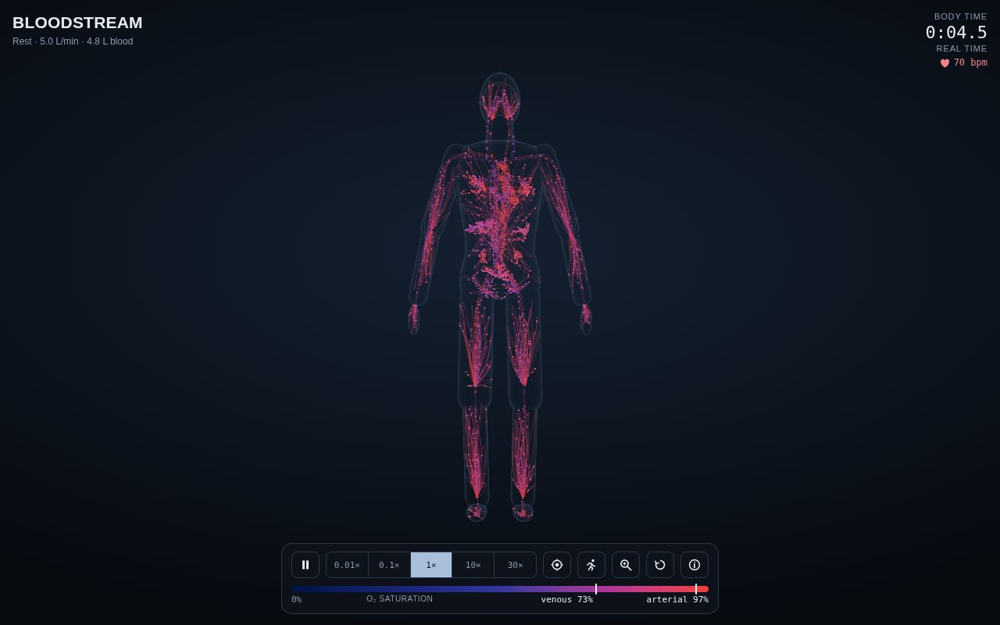
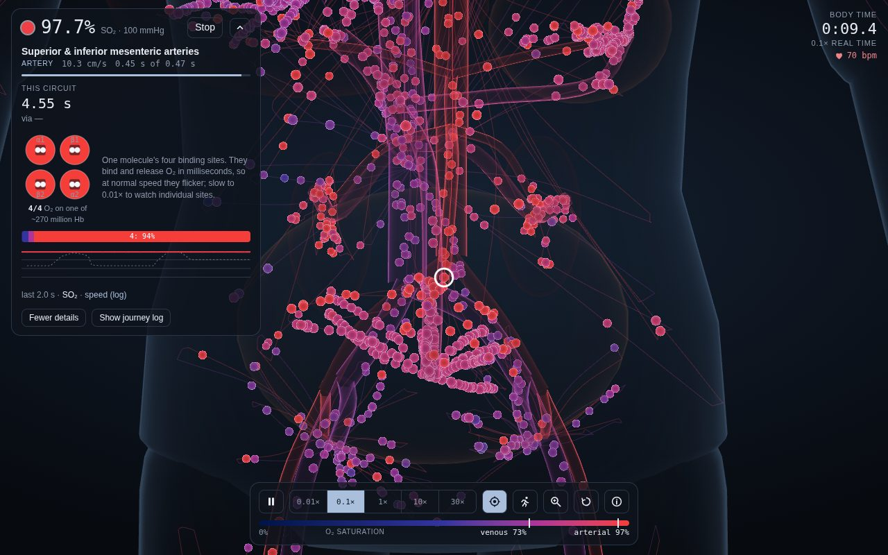
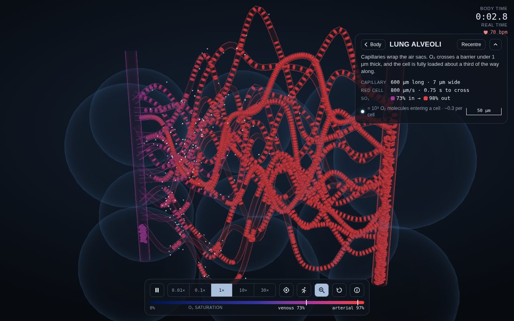
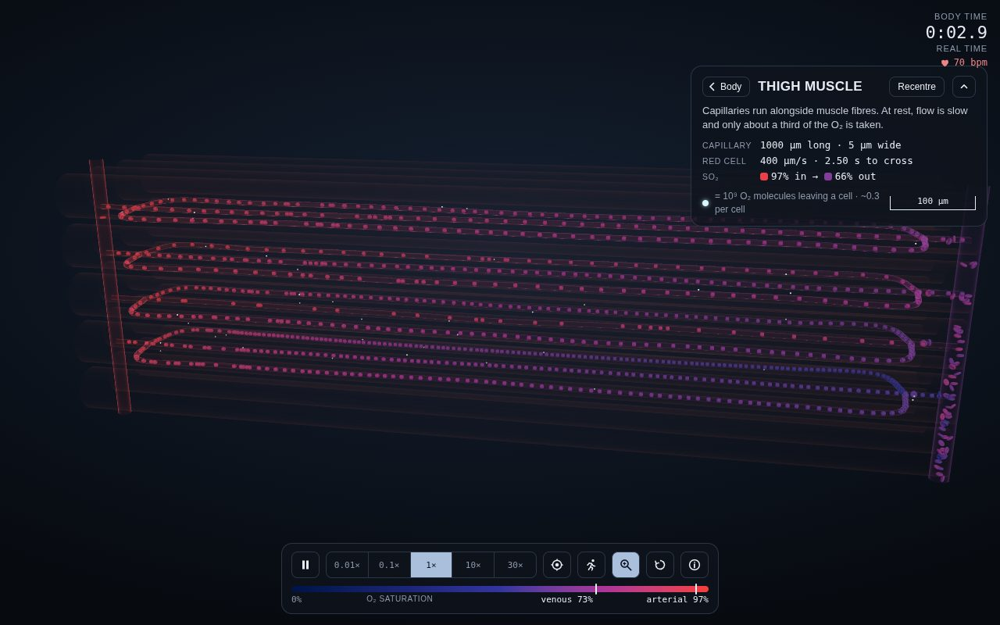
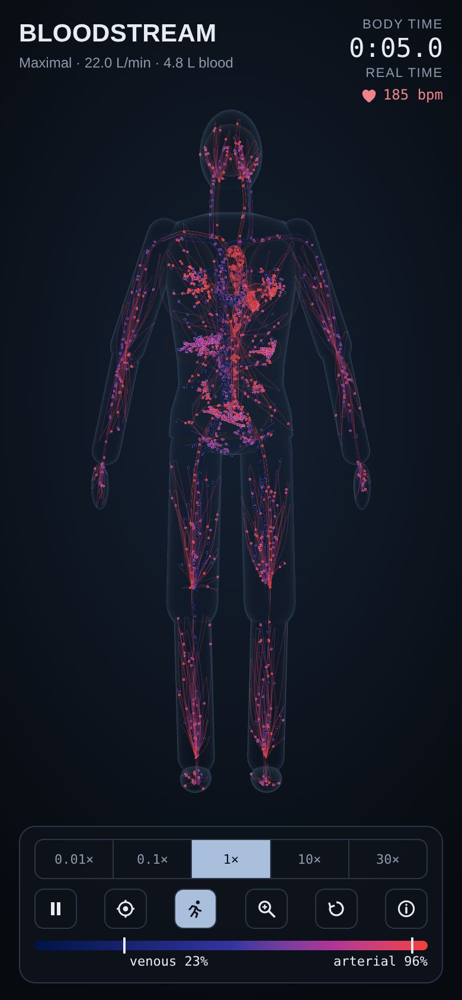

# Bloodstream

An interactive 3D visualisation of how blood moves around the body and
picks up and releases oxygen, driven by a physiology simulation whose
numbers are checked against the textbooks. It runs entirely in the browser,
on desktop and on phones.

**[Open Bloodstream →](https://kimsey0.github.io/bloodstream/)**



## What you can do

- **Watch the circulation.** Thousands of tracer red cells move through a
  stylised vascular tree at physiological speed, coloured by how much
  oxygen they carry. Slow time down to 0.01× to watch blood load in the
  lungs in about a third of a second, or speed up to 30× to see whole
  circuits.
- **Follow one red cell.** Tap any cell to follow it through the body. You
  see where it is, how fast it moves, its saturation and PO₂, and how long
  its current trip round the body has taken. Previous trips are listed with
  the organs they went through, and you can open one of its haemoglobin
  molecules with the four O₂ binding sites.
- **See the cell on the dissociation curve.** The follow panel plots the
  cell on the O₂ dissociation curve, with its recent path: up the curve in
  the lungs, down it in tissues. A second curve shows how the blood around
  it is shifted, and a readout gives its O₂ content in mL per dL, split
  into haemoglobin-bound and dissolved.
- **Zoom into capillary beds.** Tap near an organ, or use the magnifier, to
  open its capillaries at true micrometre scale. You see biconcave red
  cells in single file, and white dots for O₂ crossing the capillary wall
  (one dot per 10⁹ molecules). The panel gives the tissue's PO₂, its
  myoglobin saturation in muscle and heart, and how its diffusing capacity
  compares with rest: working muscle's rises ~30-fold.
- **Change the activity level.** Go from rest to maximal exercise. Heart rate,
  cardiac output, O₂ use, flow distribution, capillary recruitment and
  blood chemistry all change together.
- **Watch the Bohr effect.** Blood picks up CO₂ as it gives up O₂, which
  makes it more acidic. The followed cell's panel shows PCO₂ and P50
  rising and pH falling along a capillary, which helps unload
  O₂, then falling again in the lungs as CO₂ leaves.
- **See blood's true colour.** The default blue → red code is easy to
  read, but real blood is never blue. Switch to true colour to see
  oxygen-poor blood as it is: dark red.
- **Ask "what if?".** Change the blood or the air: anaemia, polycythaemia,
  altitude up to the Everest summit, carbon monoxide, or haemoglobin with a
  higher or lower O₂ affinity. Heart, brain and muscle raise their blood
  flow to compensate, and the activity sheet tells you when an activity is
  beyond this body's VO₂max. The dissociation curve can plot O₂ content as
  well as saturation, which shows what anaemia and CO do that saturation
  hides.
- **See the heartbeat.** Blood leaves the heart in pulses. Cells surge in
  the aorta during ejection, and the pulse fades to near-steady flow in the
  capillaries. In the heart wall it runs the other way: coronary flow is
  highest in diastole, when the contracting muscle stops squeezing its own
  vessels.

| Following a cell | Lung capillaries | Muscle capillaries | Maximal exercise |
|---|---|---|---|
|  |  |  |  |

## How accurate is it?

Parameters come from standard physiology references (listed below). The
headline numbers are **not set by hand**: they emerge from the model, and
the test suite checks them against published values.

| Quantity | Model | Reference |
|---|---|---|
| Blood volume / share in systemic veins | 4.8 L / 64 % | ~5 L / ~64 % |
| Arterial / mixed venous O₂ saturation at rest | 97.5 % / 73 % | 97–98 % / ~75 % |
| Mixed venous PCO₂ / pH at rest | 47 mmHg / 7.37 | 45–46 / ~7.37 |
| Time for blood to load O₂ in a lung capillary | ≈ 0.25 s of a 0.75 s transit | ~0.25 s of ~0.75 s |
| Coronary sinus / jugular / renal vein saturation | 32 / 66 / 89 % | 25–40 / 55–75 / ~90 % |
| Mean red-cell circulation time at rest / max exercise | 54 s / 13 s | ~60 s (blood) / ~13 s |
| Cardiac output and O₂ use at maximal exercise | 22 L/min, 3.25 L/min | 20–25, ~3.2 L/min |
| Alveolar–arterial PO₂ difference at max | 20 mmHg | 15–25 mmHg |
| Arterial / mixed venous / femoral venous saturation at max | 96 % / 24 % / 18 % | ≥ 95 / 20–30 / ~15 % |
| Femoral venous pH / P50 at max | 7.21 / 36 mmHg | 7.19–7.21 / 37.5 ± 3.1 mmHg |
| Working-muscle cell PO₂ / myoglobin saturation at max | 2.6 mmHg / 44 % | 3.1 mmHg / 49 % |
| Capillary RBC speed / venule speed | 0.25–0.8 mm/s / ~2 mm/s | 0.2–1.5 / 0.2–4 mm/s |
| Barometric / alveolar PO₂ on the Everest summit at rest | 253 / 35 mmHg | 253 / 35 mmHg (West et al. 1983) |
| P50 of the remaining Hb at 30 % / 50 % COHb | 18 / 13 mmHg | falls with COHb (Roughton & Darling 1944) |
| Resting SaO₂ at 3,700 m, acclimatized (Hb 17.6) | 92 % | 92.0 % (Brutsaert et al. 2000) |
| Resting cardiac output in anaemia, Hb 8 / 6 / 4 | +4 / +27 / +84 % | rises below Hb ~7 (Varat et al. 1972) |

The dissociation curve is Severinghaus's (P50 26.8 mmHg). The single
haemoglobin molecule uses Imai's Adair constants with binding rates in
Gibson's measured ranges. Lung loading is diffusion-limited, from DLO₂ and
capillary blood volume. Each organ unloads O₂ by diffusion towards its
cells' PO₂. Its diffusing capacity is set at rest from measured tissue
PO₂, and in muscle and heart rises with blood flow. At every activity
level, tissue PO₂ then settles where diffusion delivers exactly what the
tissue uses (the Fick principle). Each cell's extraction depends on how
long it lingers.
Tissues add CO₂ in proportion to the O₂ they use, so the curve shifts
right along each capillary (the Bohr effect) and back in the lungs.

## How it works

```
physiology/  parameters, O2 curve, haemoglobin, activity, heartbeat
     │
sim/circulation   220-segment vascular graph → flows, volumes, transit times
     │
sim/oxygen        steady state, O₂ diffusion and blood chemistry (Bohr integration)
     │
sim/simulation    Monte Carlo tracer cells (Web Worker): routing by flow,
     │            transit heterogeneity, pulsatile flow, O2 exchange
     │
render/ + ui/     three.js body, vessels and cells; Svelte HUD;
                  microscope view with its own local cell stream
```

- **Physiology first.** Velocity, transit time and extraction are
  derived from flow and geometry, never hand-tuned, so the whole model can be
  checked in headless tests.
- **Sampled cells.** A few thousand tracers route through the graph with
  probability proportional to flow. Round-trip times differ by route: about
  17 s through the heart wall, about 95 s through a foot.
- **Geometry follows the graph.** Named vessels have stylised 3D paths.
  Each organ's microcirculation is drawn as several strands placed in the
  tissue it supplies: under the skin, through muscle, inside organs. The
  strands branch like real vessel trees: along limb arteries, from an
  organ's hilum, over the brain and heart surfaces, or through intestinal
  arcades.
- **Colour.** By default saturation runs from deep blue to violet to red,
  the textbook code. A switch under the colour bar shows true colours
  instead: dark red to bright scarlet, because real blood is never blue.
  In both scales lightness rises steadily, and both are tested to stay
  readable with deuteranopia, protanopia and tritanopia.

See [docs/ARCHITECTURE.md](docs/ARCHITECTURE.md) for the full design and
the known simplifications, and [docs/SOURCES.md](docs/SOURCES.md) for every
physiological number: its source (with table or page), and whether it is
measured, derived, fitted to a measurement, or assumed.

## Project layout

| Path | Contents |
|---|---|
| `src/physiology/` | Reference parameters, dissociation curve, haemoglobin model, activity levels, heartbeat |
| `src/sim/` | Circulation graph, O₂ steady state, tracer simulation, cell tracking, worker and its message protocol |
| `src/anatomy/` | Stylised body shape, vessel layout, tissue territories, 3D paths and lookup tables |
| `src/micro/` | Capillary-bed microscope: bed catalogue, procedural networks, local cell stream |
| `src/render/` | three.js scenes (body and microscope), shaders, vessels, follow marker |
| `src/ui/` | Svelte HUD: dock, follow panel, microscope panel, activity sheet, pickers |
| `src/color/` | Saturation colour scale and colour-vision-deficiency simulation |
| `tests/` | Physiology validation suite (Vitest) |
| `diagnostics.html` | A plain diagnostics page of the simulation core, no 3D |

## Development

Requires Node 22.

```sh
npm install
npm run dev         # app at http://localhost:5173, diagnostics at /diagnostics.html
npm test            # physiology validation suite (98 tests)
npm run typecheck   # TypeScript + svelte-check
npm run build       # production build into dist/
```

Every push to `main` runs the typecheck, tests and build, then deploys `dist/`
to GitHub Pages ([.github/workflows/ci.yml](.github/workflows/ci.yml)).
`npm run artifact` builds a single self-contained HTML file, for hosts that
need the whole app in one file.

Contributions are welcome. Please keep physiological changes backed by a
source, record each number in [docs/SOURCES.md](docs/SOURCES.md), and run
`npm run typecheck && npm test` before opening a pull request. If you
change a parameter, the validation tests will tell you whether the
emergent numbers still match the references.

## Known simplifications

- The anatomy is stylised, and organ beds are lumped (a few hundred
  segments, not billions of capillaries). Cells and capillary loops in the
  body view are drawn far larger than life; the microscope view is true to
  scale.
- Red cells split at branches in proportion to blood flow, with no
  plasma skimming. Systemic O₂ exchange happens only in capillaries.
- Activity changes take effect almost immediately rather than over 1–2
  minutes. Exercise means running, so the arms barely work.
- Atria and veins carry no pulse.
- "What if" compensation is by blood flow only, partly assumed: how far
  each organ dilates, and one extraction reserve for all organs but the
  heart (fitted to cardiac output in anaemia, Varat et al. 1972).
  Exercise at altitude desaturates more than measured (Brutsaert et al.
  2000), because the lungs have no ventilation–perfusion mismatch. Arterial PCO₂ at altitude is interpolated
  between sea level and West's measurements above 7,800 m. Acclimatization
  beyond breathing (more Hb, more 2,3-DPG) is left to the sliders.
- The lungs have no ventilation–perfusion mismatch. Their diffusing
  capacity during exercise is set so the alveolar–arterial PO₂ difference
  matches measurements.

## Sources

Guyton & Hall, *Textbook of Medical Physiology*; Ganong's *Review of
Medical Physiology*; West, *Respiratory Physiology*; Severinghaus, J Appl
Physiol 1979 (O₂ dissociation); Imai, *Allosteric Effects in Haemoglobin*
(Adair constants); Roughton & Darling 1944 (CO and the O₂ curve); West et
al., J Appl Physiol 1983 and West 1996 (Everest gas exchange, model
atmosphere); Cotes et al. / ATS–ERS 2017 (Hb correction of diffusing
capacity); Varat et al., Am Heart J 1972 (anaemia); Brutsaert et al., Am J
Phys Anthropol 2000 (SaO₂ at altitude); Gibson and colleagues (O₂ binding kinetics); Evans &
Fung 1972 (red-cell shape); Pries et al. 1990 (capillary haematocrit);
Åstrand & Rodahl, *Textbook of Work Physiology* and Rowell, *Human
Circulation* (exercise); Dempsey & Wagner, J Appl Physiol 1999 (blood gases
at maximal exercise); Calbet et al., Am J Physiol 2005 and González-Alonso &
Calbet, Circulation 2003 (limb venous blood at maximal exercise); Hopkins
et al., Respir Physiol 1996 (pulmonary transit); Richardson et al., J Clin
Invest 1995 (muscle intracellular PO₂); Seligman et al., EuroIntervention 2022 and
Davies et al., Circulation 2006 (phasic coronary flow); Machado et al. 2009 (colour-vision simulation).
Details and specific values are in [docs/ARCHITECTURE.md](docs/ARCHITECTURE.md)
and in the doc comments of `src/physiology/`.

## Licence

[MIT](LICENSE)
